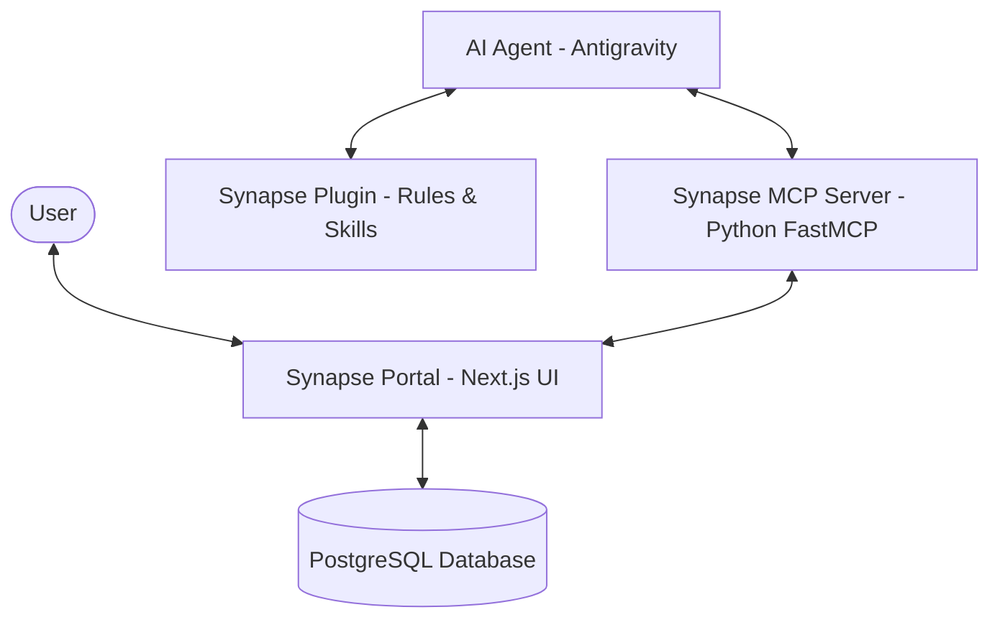

# Synapse Agents

An integrated agentic ecosystem for the **Synapse Knowledge Portal**, containing Model Context Protocol (MCP) tools, Antigravity agent personas, skills, and a Next.js web application.

---

## 🏗️ Architecture Overview

The project consists of three core components that work in tandem to power autonomous development agents and provide a visual dashboard for their operations:



1. **`synapse-portal`**: A premium Next.js dashboard that visualizes knowledge graphs, stores developer memory, hosts user personas, and exposes REST APIs/Prisma interfaces to the backend database.
2. **`synapse-mcp`**: A Python-based Model Context Protocol (MCP) server that acts as a bridge, exposing advanced developer capability tools and database operations to AI agents by interacting with the `synapse-portal` backend APIs.
3. **`synapse-plugin`**: A plugin for Google Antigravity containing 39 agent skills, 12 customized agent personas (e.g., Winston the Architect, Amelia the Web Dev), and execution rules.

---

## 📂 Project Structure

```text
synapse-agents/
├── synapse-portal/       # Next.js Web App & Database Schema
│   ├── app/              # Dashboard pages & UI components
│   ├── prisma/           # Schema definition & database seeding scripts
│   ├── scripts/          # Automation scripts (e.g., config rendering, plugin building)
│   └── tests/            # Portal unit & integration test suites
├── synapse-mcp/          # Model Context Protocol (MCP) Server
│   ├── tools/            # Python-based MCP tools implementations
│   └── requirements.txt  # Python environment dependencies
├── synapse-plugin/       # Google Antigravity Customizations
│   ├── .agents/          # Source directory for custom rules, skills, and agent personas
│   ├── docs/             # Technical specifications & documentation
│   └── AGENTS.md         # Developer & Agent guidelines
├── build/                # Compiled Antigravity plugin directory (auto-generated)
├── Makefile              # Workspace automation (up/down, format, tests, link)
├── TODO.md               # Backlog & roadmap for future enhancements
└── .env.example          # Environment variables template
```

---

## ⚙️ Prerequisites

Before running the workspace, ensure you have the following installed on your machine:

- **Docker & Docker Compose** (for running PostgreSQL and the Next.js production/dev servers)
- **Node.js 20+ & npm** (for local scripts, linting, and formatting)
- **Python 3.11+** (for running the Python virtual environment and the MCP server)
- **Make** utility

---

## 🚀 Getting Started

### 1. Environment Setup

Copy the example environment file and configure the values:

```bash
cp .env.example .env
```

Ensure you set your `CONTEXT7_API_KEY` and `STITCH_API_KEY` (if using Stitch integrations).

### 2. Run the Web App & Database

Start the Next.js portal and the PostgreSQL database container. This command automatically runs database migrations, seeds the database, and links the agent plugin:

```bash
make dev
```

Once started, the **Synapse Knowledge Portal** is accessible at:

- **Local Web Portal:** [http://localhost:3100](http://localhost:3100)

### 3. Build & Link the Plugin (Antigravity IDE)

To compile the raw skills and agent personas, and link them to your Antigravity global customization directory (`~/.gemini/config/plugins/synapse-plugin`), run:

```bash
make link:antigravity
```

---

## 🛠️ Makefile Commands Reference

| Command                 | Description                                                                                    |
| ----------------------- | ---------------------------------------------------------------------------------------------- |
| `make dev`              | Start the dashboard & database in development mode, run migrations, seed, and link the plugin. |
| `make up`               | Start the dashboard & database in production mode, run migrations, seed, and link the plugin.  |
| `make down`             | Stop and remove Docker containers.                                                             |
| `make build`            | Rebuild Docker images.                                                                         |
| `make restart`          | Restart the active containers.                                                                 |
| `make migrate`          | Run pending Prisma migrations on the active database container.                                |
| `make seed`             | Run the Prisma seed script inside the container.                                               |
| `make db-refresh`       | Reset the database (wipe all data) and seed it from scratch.                                   |
| `make check`            | Run Python linting, TypeScript/i18n validation, and Prettier checks.                           |
| `make format`           | Run Python/JS/TS/Markdown code formatters (Ruff and Prettier).                                 |
| `make test`             | Run the vitest suites inside `synapse-portal`.                                                 |
| `make link:antigravity` | Compile the plugin build and symlink it to your global configurations.                         |
| `make manifests`        | Generate portal manifests (agent-manifest.csv, skill-manifest.csv, tool-manifest.csv).         |

---

## 📖 Component Documentation

For details about each sub-component, refer to their respective README files:

- 🌐 **Web Dashboard & API:** [synapse-portal/README.md](file:///Users/user004/Documents/synapse-agents/synapse-portal/README.md)
- 🤖 **Agent Plugin & Skills:** [synapse-plugin/README.md](file:///Users/user004/Documents/synapse-agents/synapse-plugin/README.md)
- 🔌 **FastMCP Server:** [synapse-mcp/README.md](file:///Users/user004/Documents/synapse-agents/synapse-mcp/README.md)
