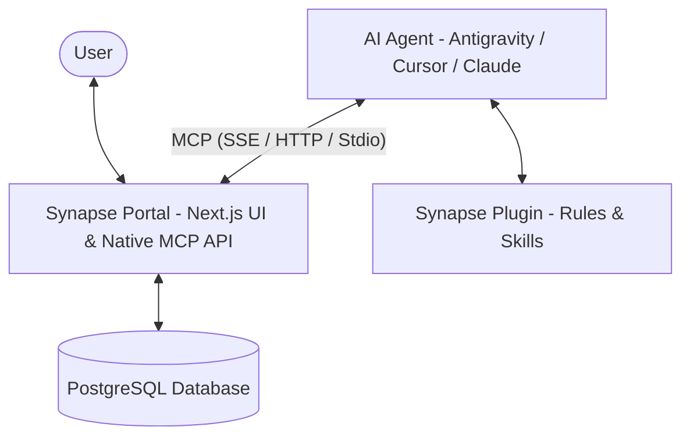

# Synapse Agents

An integrated agentic ecosystem for the **Synapse Knowledge Portal**, containing Model Context Protocol (MCP) tools, Antigravity agent personas, skills, and a Next.js web application.

---

## 🏗️ Architecture Overview

The project consists of two core components that work in tandem to power autonomous development agents and provide a visual dashboard for their operations:


```mermaid
graph TD
    User([User]) <--> Portal[Synapse Portal - Next.js UI & Native MCP API]
    Agent[AI Agent - Antigravity / Cursor / Claude] <--> Plugin[Synapse Plugin - Rules & Skills]
    Agent <-->|"MCP (SSE / HTTP / Stdio)"| Portal
    Portal <--> DB[(PostgreSQL Database)]
```

1. **`synapse-portal`**: A premium Next.js dashboard and fullstack server that visualizes knowledge graphs, stores developer memory, hosts user personas, exposes REST APIs, and provides a native Model Context Protocol (MCP) server (SSE & Stdio).
2. **`synapse-plugin`**: A plugin for Google Antigravity containing 39 agent skills, 12 customized agent personas (e.g., Winston the Architect, Amelia the Web Dev), and execution rules.

---

## 📂 Project Structure

```text
synapse-agents/
├── synapse-portal/       # Next.js Web App, DB Schema & Native MCP Server
│   ├── app/              # Dashboard pages, UI components & MCP API routes
│   ├── lib/              # Internal services, Prisma client & MCP tool modules
│   ├── prisma/           # Schema definition & database seeding scripts
│   ├── scripts/          # Automation scripts (config rendering, plugin building, mcp runner)
│   └── tests/            # Portal unit, integration & MCP test suites
├── synapse-plugin/       # Google Antigravity Customizations
│   ├── .agents/          # Source directory for custom rules, skills, and agent personas
│   ├── docs/             # Technical specifications & documentation
│   └── AGENTS.md         # Developer & Agent guidelines
├── build/                # Compiled Antigravity plugin directory (auto-generated)
├── Makefile              # Workspace automation (up/down, format, tests, link)
├── TODO.md               # Backlog & roadmap for future enhancements
└── .env.example          # Environment variables template
```

---

## ⚙️ Prerequisites

Before running the workspace, ensure you have the following installed on your machine:

- **Docker & Docker Compose** (for running PostgreSQL and the Next.js production/dev servers)
- **Node.js 20+ & npm** (for local scripts, linting, and formatting)
- **Make** utility

---

## 🚀 Getting Started

### 1. Environment Setup

Copy the example environment file and configure the values:

```bash
cp .env.example .env
```

Ensure you set your `CONTEXT7_API_KEY` and `STITCH_API_KEY` (if using Stitch integrations).

### 2. Run the Web App & Database

Start the Next.js portal and the PostgreSQL database container. This command automatically runs database migrations, seeds the database, and links the agent plugin:

```bash
make dev
```

Once started, the **Synapse Knowledge Portal** is accessible at:

- **Local Web Portal:** [http://localhost:3100](http://localhost:3100)

### 3. Build & Link the Plugin (Antigravity IDE)

To compile the raw skills and agent personas, and link them to your Antigravity global customization directory (`~/.gemini/config/plugins/synapse-plugin`), run:

```bash
make link:antigravity
```

### 4. Proactive Skill Activation in Other Repositories

To proactively activate Synapse rules and skills in other repositories you work on, copy `AGENTS.example.md` to `.agents/AGENTS.md` in the root of those repositories:

```bash
mkdir -p /path/to/your/repo/.agents
cp AGENTS.example.md /path/to/your/repo/.agents/AGENTS.md
```

This ensures that when an Antigravity agent starts in that workspace, it will automatically reference and follow the global Synapse rules/skills dynamically.

---

## 🛠️ Makefile Commands Reference

| Command                 | Description                                                                                    |
| ----------------------- | ---------------------------------------------------------------------------------------------- |
| `make dev`              | Start the dashboard & database in development mode, run migrations, seed, and link the plugin. |
| `make up`               | Start the dashboard & database in production mode, run migrations, seed, and link the plugin.  |
| `make down`             | Stop and remove Docker containers.                                                             |
| `make build`            | Rebuild Docker images.                                                                         |
| `make restart`          | Restart the active containers.                                                                 |
| `make migrate`          | Run pending Prisma migrations on the active database container.                                |
| `make seed`             | Run the Prisma seed script inside the container.                                               |
| `make db-refresh`       | Reset the database (wipe all data) and seed it from scratch.                                   |
| `make check`            | Run Python linting, TypeScript/i18n validation, and Prettier checks.                           |
| `make format`           | Run Python/JS/TS/Markdown code formatters (Ruff and Prettier).                                 |
| `make test`             | Run the vitest suites inside `synapse-portal`.                                                 |
| `make link:antigravity` | Compile the plugin build and symlink it to your global configurations.                         |
| `make manifests`        | Generate portal manifests (agent-manifest.csv, skill-manifest.csv, tool-manifest.csv).         |

---

- 🌐 **Web Dashboard & Native MCP API:** [Synapse Portal](./synapse-portal/README.md)
- 🤖 **Agent Plugin & Skills:** [Synapse Plugin](./synapse-plugin/README.md)

---

## 🎖️ Acknowledgements

This project incorporates architectural concepts, workflows, and configuration patterns adapted from:

- [BMAD Method](https://github.com/bmad-code-org/BMAD-METHOD) (MIT License) - An agile, role-based AI development framework.
