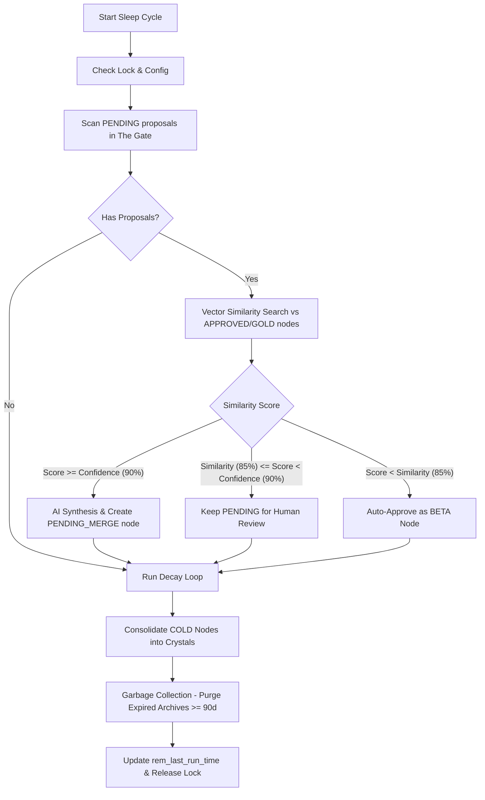

# Service / Worker: REM Sleep Cycle Consolidation Engine

[⬅ Back to Feature Catalog](../../FEATURES.md)

## 1. Trigger & Scheduling Matrix

| Process / Job Name                  | Trigger Mechanism                       | Frequency / Event Source                                                                                             | Idempotency Key / Lock                       |
| :---------------------------------- | :-------------------------------------- | :------------------------------------------------------------------------------------------------------------------- | :------------------------------------------- |
| **Scheduler Check**                 | Node.js Interval (`instrumentation.ts`) | Every 10 minutes (`10 * 60 * 1000`)                                                                                  | `rem_running` in `SystemConfig`              |
| **Consolidation Pipeline**          | Conditional Execution                   | Evaluated every $\ge 24\text{ hours}$ since `rem_last_run_time` or manual API trigger (`POST /api/gate/sleep-cycle`) | Distributed lock `rem_running = 'true'`      |
| **Memory Decay Loop**               | Sub-pipeline in Sleep Cycle             | Executed during each consolidation cycle when `forget_mode_enabled = 'true'`                                         | In-process execution within sleep cycle lock |
| **Knowledge Crystal Consolidation** | Sub-pipeline in Sleep Cycle             | Executed during each consolidation cycle                                                                             | In-process execution within sleep cycle lock |
| **Knowledge Garbage Collection**    | Sub-pipeline in Sleep Cycle             | Executed during each consolidation cycle                                                                             | In-process execution within sleep cycle lock |

---

## 2. Business Flow & Processing Pipeline

### Process: REM Sleep Consolidation Cycle

#### A. Trigger & Pre-conditions

- **Trigger**: 10-minute scheduler detects $\ge 24\text{ hours}$ have elapsed since `rem_last_run_time` AND `rem_mode_enabled = 'true'`.
- **Pre-condition**: `rem_running` lock is not `'true'`.

#### B. Step-by-Step Execution Flow

1. **Lock Acquisition**: Checks and sets `rem_running = 'true'` in `SystemConfig`.
2. **Pending Proposal Evaluation**:
   - Queries all `Node` records with `status = 'PENDING'`.
   - Executes vector cosine similarity search via `vectorService.findSimilarToNode` against approved knowledge nodes.
   - **Case 1 ($\text{Score} \ge \text{Confidence Threshold}$, e.g. $90\%$):** Automatically synthesizes content via `aiService.synthesizeKnowledge()`, creates a unified node in `PENDING_MERGE` state with `memory_tier = 'ACTIVE'`, links tag union, archives redundant proposals, and enqueues embedding calculation.
   - **Case 2 ($\text{Similarity Threshold} \le \text{Score} < \text{Confidence Threshold}$, e.g. $85\% - 90\%$):** Retains proposal in `PENDING` status for explicit human review in The Gate.
   - **Case 3 ($\text{Score} < \text{Similarity Threshold}$):** Automatically promotes unique proposal to `BETA` status with `auto_approved: true`.
3. **Memory Decay Loop**:
   - Scans `ACTIVE` nodes.
   - Evaluates virtual age ($\text{virtual\_clock} - \text{accessed\_at\_virtual\_day}$) against decay function:
     $$\text{Score} = W_2 \cdot e^{-\left(\frac{\lambda}{1 + \alpha \cdot \text{success\_count}}\right) \cdot \text{virtual\_age}} \cdot M_{\text{agent}}$$
   - When virtual age $> 90$ and score $< 40$, transitions node to `COLD` tier and strips vector embedding to conserve memory (unless `forget_dry_run_enabled = 'true'`).
4. **Knowledge Crystal Consolidation**:
   - Scans `COLD` tier nodes and groups them by technology/project scope clusters.
   - Clusters with mutual vector similarity $\ge 80\%$ are synthesized by AI into a permanent **Knowledge Crystal** (`🔮 Crystal: ...`) with `memory_tier = 'CORE'`.
5. **Garbage Collection**:
   - Permanently deletes `ARCHIVE` nodes and rejected nodes with `last_verified` older than 90 days.
6. **Completion**:
   - Updates `rem_last_run_time` timestamp.
   - Releases lock (`rem_running = 'false'`).

#### C. Failure Handling & Resilience

- **Idempotency Guard**: Re-entrant calls are blocked if lock is active.
- **Safe Release**: Lock release is guaranteed inside a `finally` block to prevent deadlocks in case of unexpected exceptions.
