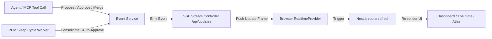

# Service / Worker: Real-time Event Pipeline & SSE State Sync

[⬅ Back to Feature Catalog](../../FEATURES.md)

## 1. Trigger & Scheduling Matrix

| Process / Job Name                 | Trigger Mechanism      | Frequency / Event Source                                    | Idempotency Key / Lock                  |
| :--------------------------------- | :--------------------- | :---------------------------------------------------------- | :-------------------------------------- |
| **SSE Client Stream Connection**   | HTTP GET Request       | Persistent connection to `GET /api/updates`                 | Connection Keep-Alive / Heartbeat (30s) |
| **State Mutation Event Broadcast** | Internal Event Emitter | Triggered on memory proposal, approval, rejection, or merge | In-memory subscriber broadcast          |

---

## 2. Business Flow & Architecture

### A. Step-by-Step Execution Flow

1. When any mutation occurs in the backend (e.g. `eventService.emit("node_created", node)` or `eventService.emit("node_updated", node)`):
   - The event payload is serialized to SSE format (`data: JSON.stringify(payload)\n\n`).
   - Dispatched to all active HTTP response streams held open by clients connected to `/api/updates`.
2. On the frontend, `RealtimeProvider` receives the message via `EventSource`.
3. Registered callbacks in `TheGate` and `OverviewPageContent` trigger an asynchronous `router.refresh()`.
4. Next.js server components re-execute their database queries in the background and reconcile the DOM with zero page flicker.
