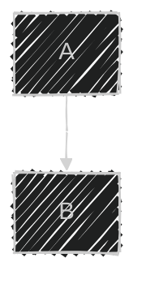

# Mermaid Generate (v11 Premium)

Create text-based diagrams using Mermaid.js v11 declarative syntax. This skill supports advanced diagram types and modern configuration patterns.

## Process

1. **Understand the Ask** — Clarify the process, architecture, or relationship to be visualized.
2. **Select Diagram Type** — Match the requirement to the best Mermaid diagram type:
   - `flowchart` (Process flows, decision trees) - _Note: Use `flowchart` instead of `graph` for v11 features._
   - `sequenceDiagram` (Actor/Service interactions)
   - `classDiagram` (Class structures, data models)
   - `erDiagram` (Database relationships)
   - `stateDiagram-v2` (State machines)
   - `gantt` (Timelines)
   - `journey` (User journeys)
   - `architecture` (High-level system design - v11)
   - `packet` (Network packet structures - v11)
3. **Draft with Config** — Use frontmatter for styling and configuration (themes, fonts).
4. **Iterate** — Refine syntax based on rendering requirements.

## Modern Syntax (v11)

### Configuration Frontmatter



### Architecture Diagrams (v11)


## Output Standards

- Always wrap in ` ```mermaid ` code blocks.
- Include single-line comments `%%` for complex logic explanation.
- Ensure all nodes have clear labels.
